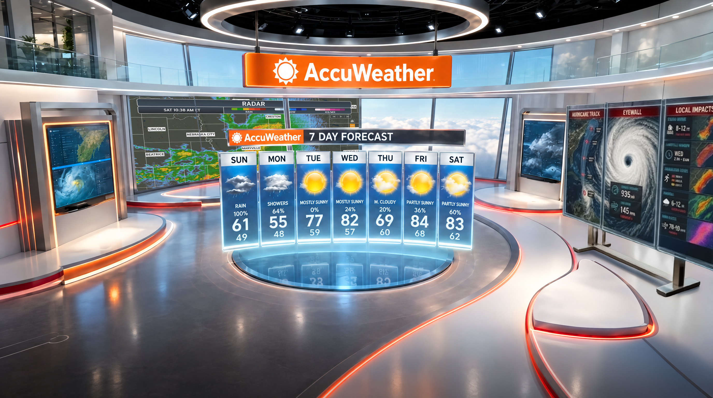

# Project Brief: AccuWeather 3D Studio Brand Integration

**Audience:** Design, brand, broadcast, and 3D set teams
**Status:** Review and ideation
**Constraint:** Do not change the core forecasting user experience

---

## Purpose

Review the attached 3D TV studio still and generate ideas for integrating the AccuWeather brand more fully into the set.

The forecast product is already working. This brief is **not** a request to redesign weather graphics, rewrite the 7-day layout, or change how viewers read temperature, condition, or radar data.

The ask is to find **new brand moments in the architecture, lighting, materials, and non-forecast surfaces** so the set feels unmistakably AccuWeather without competing with the forecast.

---

## The still we are reviewing

This is a circular, camera-ready news studio. From the still, the current model includes:

- An overhead **AccuWeather** wordmark and sun mark on an orange beam
- A matching **7 DAY FORECAST** header on the center unit
- A seven-column daily forecast (condition icon, precip chance, high / low)
- A large radar / map wall behind the forecast unit
- Side monitors for hurricane / satellite imagery and storm metrics
- A dark circular floor, a raised white presenter ring, and orange LED edge lighting
- A ceiling ring and open walking space around the forecast podium

Treat this still as the source of truth for what already exists. If something is on a forecast display in this image, leave it alone.

---

## Objective

Propose brand integration ideas that make the studio feel more AccuWeather-owned while leaving every forecasting display exactly as it is.

Success looks like:

- A viewer can tell this is AccuWeather even if the logo beam is out of frame
- Talent can walk the ring and present without brand treatments covering data
- Weather remains the hero. Brand supports it. It does not decorate over it.

---

## Locked: do not change these

These surfaces carry the **current forecasting user experience**. They are out of scope for this exercise.

1. **Center 7-day forecast unit**
   Day labels, icons, condition copy, precip percentages, and high / low temperatures stay as modeled. Do not restyle, reorder, overlay, or crop this board to make room for brand.

2. **Forecast header bar**
   The existing `AccuWeather 7 DAY FORECAST` bar is part of the current product chrome. Do not replace it with a campaign lockup or a thicker brand frame that eats into the columns.

3. **Background radar / map wall**
   Keep the map readable. No watermarks, pattern fills, or logo repeats on the radar itself.

4. **Side weather monitors**
   Hurricane imagery, track / eyewall / local-impact panels, and any numeric callouts stay intact. Do not add bugs, banners, or logo slates on top of that content.

5. **Information hierarchy**
   Weather data must remain the first thing the eye reads. Brand work cannot increase visual noise on the boards or force the viewer to hunt for numbers.

If an idea only works by covering, shrinking, or restyling a forecast display, it is the wrong idea.

---

## Open: where brand innovation should live

Explore the set around the forecasts, not the forecasts themselves.

| Zone | Why it is fair game |
| --- | --- |
| Floor, presenter ring, and LED edge lighting | Camera-facing architecture that never holds weather data |
| Ceiling ring, overhead lighting, and hanging hardware | Brand presence from wide shots and crane moves |
| Monitor bezels, columns, and physical frames | Identity on the object, not on the content |
| Talent walking paths and presenter positions | Brand that reads in a two-shot without blocking boards |
| Materials, color, and finish | AccuWeather orange / white / sky language beyond the logo beam |
| Off-display motion or ambient light | Atmosphere that does not sit on top of numbers |

Starter questions (use these; do not stop at them):

- How could the sun mark live in lighting, floor inlay, or ceiling geometry without becoming a second logo stacked on the forecast?
- Can orange LED work harder as a brand system (pace, segments, storm-state mood) without pulsing over the 7-day columns?
- What would make a tight shot of the presenter ring feel branded if the overhead beam is cropped out?
- Are there physical or material cues (finish, texture, edge profile) that read AccuWeather without adding more wordmarks?
- Can side-monitor *housings* carry brand while the *screens* stay pure weather?

---

## What we want back from the team

Please review the still and come back with **2–4 distinct directions**, not a single finished design.

For each direction, include:

1. **Name** of the idea (a short working title)
2. **Where it lives** on the set (floor, ceiling, frames, lighting, etc.)
3. **What the viewer / talent notices**
4. **Why it does not interfere** with the 7-day unit, radar wall, or side weather screens
5. **Risks** (readability, over-branding, camera angles, lighting spill)

Optional but useful: a quick sketch, overlay, or callout on a copy of the still. Mark brand-safe zones in one color and locked forecast surfaces in another.

---

## Guardrails

- Do not invent a new forecast UI, icon set, or day-column layout.
- Do not put logos, slogans, or campaign art on weather maps or temperature boards.
- Prefer one strong architectural brand idea over many small stickers.
- Keep presenter sightlines and walking paths clear.
- Assume this still is a wide hero shot. Ideas should also survive medium and close-up shots.
- If you need brand assets beyond what is visible here (official orange, sun mark clear space, type), flag that as a dependency. Do not guess a new mark.

---

## How to use this still in review

1. Look at the image for 30 seconds as a viewer. What already says AccuWeather? What just says “generic weather studio”?
2. Circle every surface that currently holds forecast data. Those circles are locked.
3. Circle every surface that does *not* hold forecast data. Those are the ideation field.
4. Propose brand moves only inside the second set of circles.
5. Check each idea against a simple test: **If we muted the logo beam, would a viewer still feel AccuWeather, and could they still read Sunday–Saturday at a glance?**

---

## Success criteria

A direction is ready for a follow-up working session if it is:

- **On-brand** without adding new marks on top of weather
- **Non-interfering** with every forecast display in the current model
- **Camera-aware** (works in wide, medium, and presenter-forward shots)
- **Buildable** in the 3D set (architecture, lighting, or material, not a graphic overlay on data)
- **Clear enough** that another artist could block it in the model without touching the forecast boards
